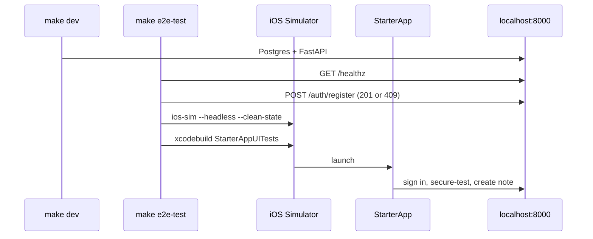

# E2E UI Tests — Design Spec

**Date:** 2026-07-02  
**Status:** Approved  
**Branch target:** `main` (new work)

## Goal

Add a **local-only** end-to-end test path that runs XCUITest against the iOS Simulator while the app talks to the **existing dev stack** (`make dev` → `localhost:8000` + Postgres). v1 proves one happy path: sign in → secure-test → create note → see note in list.

## Non-goals (v1)

- GitHub Actions / CI job for E2E
- Dedicated E2E database or Docker profile
- Test-only backend reset endpoint
- Note teardown / DB cleanup after test
- Launch-argument overrides for `BACKEND_URL`
- Replacing backend integration tests or iOS unit tests

## Decisions (brainstorming outcomes)

| Topic | Choice |
|-------|--------|
| Test scope | Single happy path (sign in → secure-test → one note) |
| Where it runs | Local only — `make e2e-test` |
| Stack | Reuse dev stack already running (`make dev`) |
| Test user | Fixed credentials in UI test; harness ensures user exists via curl |
| Simulator state | `--clean-state` before run (Keychain cleared, signed out) |

## Architecture

**Prerequisites:** Developer runs `make dev` before `make e2e-test`. Harness fails fast with a clear message if `/healthz` is not 200.

**Not part of `make validate`:** E2E is slow and requires a live stack; keep the fast CI gate unchanged.

## App testability

Add `accessibilityIdentifier` only where labels are ambiguous or dynamic:

| UI element | Identifier |
|------------|------------|
| Root signed-out "Sign In" button | `auth.openSignIn` |
| Auth email field | `auth.email` |
| Auth password field | `auth.password` |
| Auth primary action ("Log In") | `auth.submit` |
| Secure-test button | `home.secureTest` |
| Secure-test success message | `home.secureTestResult` |
| "New Note" button | `notes.add` |
| Note composer title field | `notes.titleField` |
| Note composer "Add" button | `notes.save` |
| Note row (dynamic) | `notes.row.<title>` |

Navigation assertions without new IDs:

- Signed out: `"Sign in to continue"` visible
- Signed in: navigation title `"Starter"` visible

Hardcoded E2E credentials (UI test + harness script, must match):

- Email: `e2e@example.com`
- Password: `E2ETest123!`

## Harness (`scripts/e2e-test.sh`)

1. `GET /healthz` — exit 1 if not 200
2. `POST /api/v1/auth/register` with E2E credentials — accept **201** (created) or **409** (already registered)
3. `./scripts/ios-sim.sh --headless --clean-state` — boot simulator, erase state
4. `xcodebuild test -only-testing:StarterAppUITests/E2EHappyPathTests/testSignInSecureTestAndCreateNote`
5. Propagate exit code

## UI test (`E2EHappyPathTests`)

| Step | Action | Assert |
|------|--------|--------|
| 1 | Launch | `"Sign in to continue"` visible |
| 2 | Tap `auth.openSignIn` | Auth sheet (`"Account"` nav title) |
| 3 | Fill email/password, tap `auth.submit` | Wait for loading to finish |
| 4 | — | `"Starter"` nav title |
| 5 | Tap `home.secureTest` | Wait for async call |
| 6 | — | `home.secureTestResult` exists and non-empty |
| 7 | Tap `notes.add`, fill `notes.titleField`, tap `notes.save` | |
| 8 | — | StaticText with identifier `notes.row.E2E smoke note` |

Use `XCTWaiter` / `waitForExistence(timeout:)` for async UI; `continueAfterFailure = false`.

## Documentation

- `local-setup.md` — short "E2E UI tests" section: requires `make dev`, then `make e2e-test`
- `AGENTS.md` — add `make e2e-test` under verification (local only, not in `validate`)
- `Makefile` `help` — new `e2e-test` target

## Future (out of scope)

- macOS CI job on `main`
- Dedicated `postgres_e2e` DB
- `POST /api/v1/test/reset` endpoint
- Additional UI tests (auth failure, notes CRUD, sign out)
- Screenshot-on-failure helper shared across UI tests
