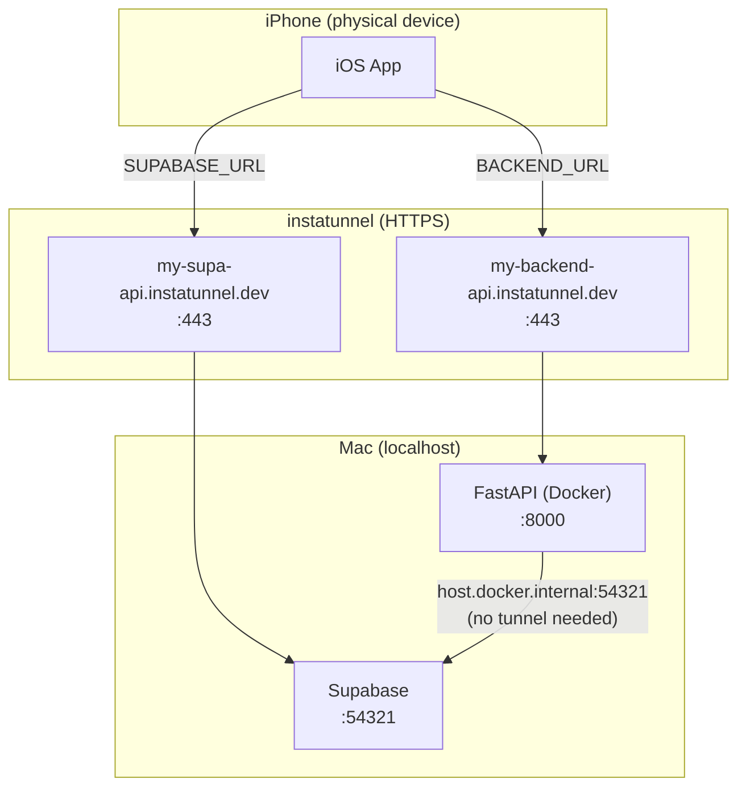

# Local Dev Runbook

## Prerequisites

The scripts and manual steps below require the following tools to be installed:

| Tool | Install |
|------|---------|
| **mise** | `curl https://mise.run \| sh` — then `mise install` from the repo root to get Python, uv, Tuist, and the Supabase CLI at the pinned versions in `.mise.toml` |
| **Docker Desktop** | https://www.docker.com/products/docker-desktop/ |
| **instatunnel** | `npm install -g instatunnel` (requires Node.js) — default choice in `run.sh` for exposing local ports to HTTPS URLs so a **physical** iOS device can reach Supabase and the backend. **The Simulator does not need a tunnel** — use `http://127.0.0.1` URLs (see [Tunnel alternatives](#tunnel-alternatives-ngrok-and-cloudflare-tunnel)). For other tools, use [ngrok](https://ngrok.com/) or [Cloudflare Tunnel](https://developers.cloudflare.com/cloudflare-one/connections/connect-apps/) (`cloudflared`) instead — same idea, different CLI. |

---

## Tunnel alternatives: ngrok and Cloudflare Tunnel

Use this whenever you do not want to rely on instatunnel, or to compare against the docs above.

### iOS Simulator (no tunnel)

The Simulator shares the Mac’s network stack. Point `BACKEND_URL` and `SUPABASE_URL` in your xcconfig at local HTTP URLs, for example:

- `BACKEND_URL` → `http://127.0.0.1:8000`
- `SUPABASE_URL` → `http://127.0.0.1:54321`

No HTTPS tunnel process is required. If App Transport Security blocks plain HTTP in your build, add or adjust the Debug ATS exception your project already uses for local dev.

### Physical device — same ports, different tunnel CLI

You still need **two** public HTTPS endpoints: one forwarding to **54321** (Supabase API) and one to **8000** (FastAPI). After each tunnel prints its URL, put them in `Config-Debug.xcconfig` as `SUPABASE_URL` and `BACKEND_URL` (same shape as the instatunnel hostnames).

**ngrok** (install from [ngrok.com](https://ngrok.com/), authenticate once with your authtoken):

```sh
# Two terminals (or two ngrok sessions with different ports)
ngrok http 54321
ngrok http 8000
```

Each command shows an `https://….ngrok-free.app` (or similar) forwarding URL. Copy the Supabase tunnel URL into `SUPABASE_URL` and the backend tunnel URL into `BACKEND_URL`. On the free tier, URLs change each run unless you use a [reserved domain](https://ngrok.com/docs/guides/how-to-set-up-a-reserved-domain/).

**Cloudflare Tunnel** (install [`cloudflared`](https://developers.cloudflare.com/cloudflare-one/connections/connect-apps/install-and-setup/installation/)):

```sh
# Two terminals — quick tunnels, no Cloudflare account required
cloudflared tunnel --url http://127.0.0.1:54321
cloudflared tunnel --url http://127.0.0.1:8000
```

Each prints a `https://….trycloudflare.com` URL. Use those for `SUPABASE_URL` and `BACKEND_URL` respectively. URLs are ephemeral per run unless you configure a [named tunnel and DNS](https://developers.cloudflare.com/cloudflare-one/connections/connect-apps/).

If you use ngrok or Cloudflare instead of instatunnel, replace **Tab 3** and **Tab 4** in [Running manually](#running-manually-4-terminal-tabs) with the commands above, and skip editing `SUPA_SUBDOMAIN` / `BACKEND_SUBDOMAIN` in `run.sh` unless you customize the scripted flow.

---

## One-time setup

1. **Backend env** — copy `backend/.env.example` → `backend/.env`.
   Fill in `SUPABASE_PUBLIC_ANON_KEY` after running `supabase start` for the first time:
   ```sh
   supabase start
   supabase status   # copy the anon key from here
   ```
   Paste it into `backend/.env` at `SUPABASE_PUBLIC_ANON_KEY=`.

2. **Install Tuist** (if not already installed):
   ```sh
   curl -Ls https://install.tuist.io | bash
   ```

3. **iOS xcconfig** — copy the example file and fill in your values:
   ```sh
   cp ios/StarterApp/Config.example.xcconfig ios/StarterApp/Config-Debug.xcconfig
   cp ios/StarterApp/Config.example.xcconfig ios/StarterApp/Config-Release.xcconfig
   ```
   Then edit both files and set:
   - `DEVELOPMENT_TEAM` — your 10-character Apple Team ID (find it at developer.apple.com → Account → Membership)
   - `PRODUCT_BUNDLE_IDENTIFIER` — e.g. `com.yourcompany.yourapp`
   - `SUPABASE_ANON_KEY` — paste the anon key from `supabase status`
   - `SUPABASE_URL` / `BACKEND_URL` — for a **physical device**, use your tunnel HTTPS URLs (instatunnel, ngrok, or Cloudflare — see [Tunnel alternatives](#tunnel-alternatives-ngrok-and-cloudflare-tunnel)); for the **Simulator**, use `http://127.0.0.1:54321` and `http://127.0.0.1:8000`

4. **Generate the Xcode project** — the `.xcodeproj` is not committed; Tuist generates it from `Project.swift`:
   ```sh
   cd ios/StarterApp
   tuist install   # fetches SPM dependencies, creates Tuist/Package.resolved
   tuist generate  # generates StarterApp.xcodeproj
   ```
   Re-run `tuist generate` any time `Project.swift` changes. Re-run `tuist install && tuist generate` when `Tuist/Package.swift` changes (new dependencies).

5. **Tunnel subdomains** — the two subdomain names live at the top of `run.sh`. Edit them once to match your chosen `instatunnel` subdomains:
   ```sh
   SUPA_SUBDOMAIN="my-supa-api"
   BACKEND_SUBDOMAIN="my-backend-api"
   ```

6. **Auth deep links** — `supabase/config.toml` must list your app URL scheme in `additional_redirect_urls` (default: `com.example.starter://`). Keep it in sync with `APIConfig.authRedirectScheme` and `CFBundleURLSchemes` in `Project.swift`.

---

## Running with scripts (easiest)

From the repo root:

```sh
./run.sh          # start everything using the existing backend image
./build-run.sh    # rebuild the backend Docker image first, then start everything
```

Both scripts:
- Run `supabase start` first (synchronous — exits once all Supabase containers are healthy)
- Then background the backend and both tunnels
- Print the live tunnel URLs once everything is up
- **Ctrl+C stops all services cleanly**

---

## Running manually (4 terminal tabs)

Use this if you want separate log streams or need to restart one service independently.

### Tab 1 — Supabase
```sh
supabase start
# Exits automatically once all containers are healthy.
# To stop later: supabase stop
```

### Tab 2 — Backend
```sh
cd backend
docker compose up             # use existing image
# or to rebuild first:
docker compose up --build
```

### Tab 3 — Supabase tunnel (port 54321)
```sh
instatunnel 54321 --subdomain my-supa-api
```

### Tab 4 — Backend tunnel (port 8000)
```sh
instatunnel 8000 --subdomain my-backend-api
```

Then build and run the iOS target on your device in Xcode (**Debug** configuration).

---

## Ports at a glance

| Service          | Local port | Tunnel URL (example)                        |
|------------------|------------|---------------------------------------------|
| Supabase API     | 54321      | https://my-supa-api.instatunnel.dev         |
| Supabase Studio  | 54323      | http://127.0.0.1:54323 (local only)         |
| FastAPI backend  | 8000       | https://my-backend-api.instatunnel.dev      |

---

## How it fits together



The iOS app only ever talks to the two tunnel URLs. The backend skips the tunnel entirely and reaches Supabase via `host.docker.internal`, which Docker Desktop for Mac resolves to the host machine automatically.
