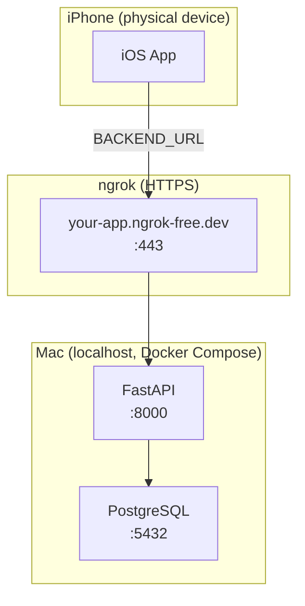

# Local Dev Runbook

How to run the full stack locally — PostgreSQL + FastAPI (Docker Compose) plus the iOS app
on the Simulator or a physical iPhone. Auth is self-hosted (bcrypt + HS256 JWT); there is no
Supabase in this stack.

## Prerequisites

| Tool | Install |
|------|---------|
| **mise** | `curl https://mise.run \| sh` — then `mise install` from the repo root to get Python, uv, and Tuist at the versions pinned in `.mise.toml` |
| **Docker Desktop** | https://www.docker.com/products/docker-desktop/ (runs Postgres + FastAPI + Adminer) |
| **ngrok** *(physical device only)* | `brew install ngrok`, then `ngrok config add-authtoken <token>` once. Needed so a phone can reach the backend over HTTPS. |
| **libimobiledevice** *(optional)* | `brew install libimobiledevice` — for streaming physical-device logs via `ios-device.sh --logs` (requires USB). |

The Simulator needs **no** tunnel — it shares the Mac's network and talks to `http://localhost:8000` directly.

---

## One-time setup

The fastest path is `make bootstrap`, which copies both `.env` files, generates a `JWT_SECRET`,
and installs tool + Python dependencies:

```sh
make bootstrap
```

Or do it by hand:

1. **Env files** — copy the templates and set a JWT secret:
   ```sh
   cp .env.example .env
   cp backend/.env.example backend/.env
   # generate a secret and put it in JWT_SECRET (both files use the same value)
   openssl rand -hex 32
   ```
   Root `.env` holds Docker Compose vars; `backend/.env` holds app config for local `uv run`.

2. **Dependencies:**
   ```sh
   mise install
   cd backend && uv sync && cd ..
   ```

3. **iOS xcconfig** — copy the example and fill in your values (the real files are gitignored):
   ```sh
   cp ios/StarterApp/Config.example.xcconfig ios/StarterApp/Config-Debug.xcconfig
   cp ios/StarterApp/Config.example.xcconfig ios/StarterApp/Config-Release.xcconfig
   ```
   Then set in `Config-Debug.xcconfig`:
   - `PRODUCT_BUNDLE_IDENTIFIER` — a reverse-DNS id **unique to your Apple team** (the
     `com.yourcompany.yourapp` placeholder and `com.example.*` cannot register for a device build).
   - `DEVELOPMENT_TEAM` — your 10-char Team ID (developer.apple.com → Account → Membership).
     Optional for `make ios-device`, which auto-detects it from your keychain cert; required to
     build to a device from the Xcode GUI.
   - `BACKEND_URL` — leave as `http://localhost:8000` for the Simulator. For a physical device you
     don't edit this by hand: `make ios-device` rewrites it with the live ngrok URL.

4. **Generate the Xcode project** — the `.xcodeproj`/`.xcworkspace` are generated by Tuist, not committed:
   ```sh
   make ios-gen        # = cd ios/StarterApp && tuist install && tuist generate
   ```
   Re-run after changing `Project.swift`; re-run `tuist install` too when `Tuist/Package.swift` changes.

---

## Running on the Simulator (easiest)

```sh
make dev
```

`scripts/dev.sh` brings up Postgres + FastAPI + Adminer via Docker Compose, runs Alembic migrations,
points the iOS `Config-Debug.xcconfig` at local URLs, runs `tuist generate`, then builds and launches
the app in the iOS Simulator. **Ctrl+C stops everything.**

Useful flags: `make dev ARGS="--regen"` (tuist install + generate), `ARGS="--no-ios"` (services only),
`ARGS="--sim-logs"` (stream Simulator logs).

---

## Running on a physical iPhone

One command handles the tunnel, signing, install, and launch:

```sh
make ios-device
# or, with options:
./scripts/ios-device.sh --verify-launch 5 --logs
```

What it does: start (or reuse) an **ngrok** tunnel to the backend → write that HTTPS URL into
`BACKEND_URL` in `Config-Debug.xcconfig` → `xcodebuild -destination generic/platform=iOS` with
automatic signing → `xcrun devicectl device install app` → `... process launch`.

Notes:
- **Backend must be running first** (`make dev` or `docker compose up -d`). The script checks
  `http://localhost:8000/healthz` before tunneling.
- **ngrok, not cloudflared.** Some ISP resolvers return NXDOMAIN for `*.trycloudflare.com`, so
  cloudflare quick tunnels can fail on both the Mac and the phone. ngrok's domains resolve normally.
  On the free tier the URL changes each session; reserve a domain and pass
  `--domain <name>.ngrok-free.dev` (or set `NGROK_DOMAIN`) for a stable URL.
- **Signing:** team auto-detected from your `Apple Development` keychain cert; override with
  `--team <ID>` / `IOS_DEVELOPMENT_TEAM`. Dev builds use `StarterApp.dev.entitlements` (Sign In
  with Apple kept, Apple Pay dropped — it needs a merchant ID); `--full-entitlements` uses the real one.
- **Use USB.** Over Wi-Fi, build + install are reliable but `devicectl` *launch* and `--logs`
  (`idevicesyslog`) are flaky/unavailable. A cable makes both reliable.
- Stop the tunnel later with `./scripts/ios-device.sh --stop-tunnel`.

Other flags: `--no-tunnel` (BACKEND_URL already reachable), `--device-id <udid>`, `--regen`.

---

## Ports at a glance

| Service         | Local port | URL                                  |
|-----------------|------------|--------------------------------------|
| FastAPI backend | 8000       | http://localhost:8000 (docs `/docs`) |
| Adminer (DB UI) | 8080       | http://127.0.0.1:8080 (local only)   |
| PostgreSQL      | 5432       | localhost:5432 (local only)          |

---

## How it fits together



The Simulator skips the tunnel entirely and hits `http://localhost:8000`. Only a physical device
needs ngrok, because it can't reach the Mac's `localhost`.
